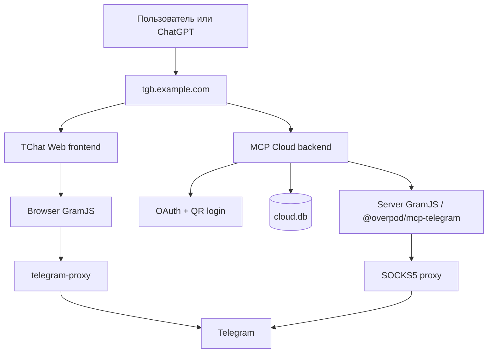

# Архитектура TChat / Telegram MCP

Этот документ описывает фактическую схему проекта на момент текущего
развёртывания. Он разделяет Telegram Web frontend, серверный MCP backend и
сетевой proxy-контур. Архитектура не должна считаться схемой официального
Telegram: это fork Telegram Web с отдельным MCP-сервисом.

## Короткая схема



Есть два режима работы Telegram:

| Режим | Где выполняется Telegram-клиент | Где живёт сессия | Для чего используется |
| --- | --- | --- | --- |
| Локальный | В браузере пользователя | В браузерном runtime | Обычный TChat/Telegram Web |
| Серверный | В `mcp-telegram-cloud` | В SQLite cloud backend | ChatGPT, MCP и серверные tool calls |

Сейчас это два разных GramJS runtime. Общими являются MCP-контракт,
OAuth-модель и маршрутизация, но исходники browser GramJS из Telegram Web не
являются тем же самым npm runtime, который использует `@overpod/mcp-telegram`.

## Репозитории и каталоги

### Основной Git checkout

```text
/home/example/telegram-tt-beauty-main
```

Это основной checkout fork-а, ветка `main`, который открыт в Codex. Здесь
находится browser Telegram Web fork и его документация.

### Frontend runtime-копия

```text
/home/example/services/tgb-telegram-tt-docker
```

Это Compose-контур, из которого фактически запускается frontend на app host.
Он содержит `web` и `telegram-proxy` сервисы. Это отдельная рабочая копия
runtime, а не автоматически собранный контейнер из этого checkout.

### MCP Cloud backend

```text
/home/example/services/mcp-telegram-cloud
```

Это отдельный cloud backend, который сейчас не является Git-репозиторием.
Он запускается отдельным Compose-файлом:

```text
/home/example/services/mcp-telegram-cloud/docker-compose.tgb.yml
```

Архитектурные изменения backend нужно документировать и в этом файле
архитектуры, и в документации самого cloud-каталога, если меняется его
runtime-поведение.

## Frontend: Telegram Web

Compose-файл:

```text
/home/example/services/tgb-telegram-tt-docker/docker-compose.yml
```

Сервисы:

- `web` — собранный Telegram Web fork, браузерный UI и browser-side GramJS;
- `telegram-proxy` — тонкий CORS/WebSocket/Telegram transport proxy, не MCP
  backend и не владелец серверных Telegram-сессий.

Поток локального режима:

```text
Browser
  → TChat Web
  → browser GramJS
  → /proxy/
  → telegram-proxy
  → Telegram
```

Сессия локального режима принадлежит браузеру пользователя. Перезапуск
серверного MCP backend не должен переносить или подменять эту сессию.

## MCP Cloud: серверный Telegram backend

Главные части cloud backend:

| Путь | Ответственность |
| --- | --- |
| `src/server.tsx` | Создание HTTP-приложения и подключение маршрутов |
| `src/routes/oauth.tsx` | OAuth discovery, DCR, authorize, QR flow и token endpoint |
| `src/routes/mcp.ts` | Bearer-аутентификация и MCP HTTP routes |
| `src/oauth.ts` | Authorization codes, PKCE, access/refresh tokens |
| `src/session-manager.ts` | Сохранение и восстановление серверных Telegram-сессий |
| `src/qr-login.ts` | Серверная Telegram QR-авторизация |
| `@overpod/mcp-telegram` | Telegram MCP tools и серверный GramJS runtime |
| `/app/data/cloud.db` | SQLite с Telegram-сессиями и OAuth-состоянием |

Поток серверного режима:

```text
ChatGPT
  → OAuth authorization
  → MCP Cloud
  → @overpod/mcp-telegram / server GramJS
  → configured SOCKS5 proxy
  → Telegram
```

Если переменные `TELEGRAM_PROXY_*` включены, серверный Telegram runtime
использует этот proxy для MTProto-трафика: сообщения, медиа, изображения,
стикеры и остальные запросы, выполняемые тем же Telegram client runtime.
Звонки не следует считать поддержанным MCP-инструментом только потому, что
обычный Telegram-клиент умеет звонить.

## HTTP-маршруты

Cloud backend подключает следующие группы маршрутов:

```text
/health                         health check
/.well-known/oauth-*            OAuth/MCP discovery
/oauth/*                        register, authorize, token, revoke
/mcp                            Streamable HTTP MCP endpoint
/.well-known/oauth-protected-resource/_mcp-bridge/<id>/mcp
                                ChatGPT connector bridge alias
/login/*                        login-related routes
/my/*                           user settings and uploads
/accounts/*                     account management
/qr/*                           QR password back-channel
```

### ChatGPT OAuth + MCP flow

```text
1. ChatGPT → GET /mcp
2. Backend → 401 + WWW-Authenticate resource_metadata
3. ChatGPT → protected-resource metadata
4. ChatGPT → authorization-server metadata
5. ChatGPT → POST /oauth/register
6. ChatGPT → GET /oauth/authorize
7. User authenticates via saved session or Telegram QR
8. Backend redirects with authorization code
9. ChatGPT → POST /oauth/token with PKCE verifier
10. ChatGPT → bridge metadata path
11. ChatGPT → bridge-path/mcp initialize
12. ChatGPT → bridge-path/mcp tools/list
```

The bridge path contains an opaque connection id. It is not a Telegram user id
and must never be used as an account selector. It applies the same Bearer token
validation as `/mcp`.

## Сессии и ответственность за данные

```text
Локальный режим:
  browser storage/runtime → browser GramJS → Telegram

Серверный режим:
  cloud.db → SessionManager → @overpod/mcp-telegram → Telegram
```

`web` отдаёт UI и обслуживает браузерный Telegram runtime. Он не является
серверным backend для ChatGPT.

`mcp-telegram-cloud` является серверным backend: он хранит серверную сессию,
выдаёт OAuth tokens, создаёт MCP transport sessions и вызывает Telegram tools.

`telegram-proxy` frontend-контура и SOCKS5 proxy cloud-контура — разные
транспортные роли. Не следует считать, что один proxy автоматически хранит
все Telegram-сессии: сессия хранится там, где живёт соответствующий Telegram
client runtime.

## Runtime ports и домены

Текущий наблюдаемый app host: `127.0.0.1`.

| Контур | Runtime |
| --- | --- |
| Frontend web | `tgb-telegram-tt-docker-web-1`, host port `35623` |
| Frontend proxy | `tgb-telegram-tt-docker-telegram-proxy-1`, internal port `7777` |
| MCP Cloud | `mcp-telegram-cloud-cloud-1`, host port `35624` → container `3000` |

В текущей TGB-схеме один публичный host может обслуживать разные функции по
пути: `/` отдаёт frontend, а `/.well-known/*`, `/oauth/*` и `/mcp` должны
попадать в cloud backend. Поэтому диагностика должна проверять не только
порт контейнера, но и конечный публичный URL.

## Проверка и deployment

Cloud backend содержит unattended smoke-тест:

```text
/home/example/services/mcp-telegram-cloud/scripts/mcp-smoke.ts
```

Он проверяет OAuth discovery, `WWW-Authenticate`, DCR, PKCE token exchange,
bridge metadata, MCP `initialize` и `tools/list`. Временные OAuth-записи
удаляются после теста; QR для теста не сканируется.

Единая команда cloud deployment:

```bash
cd /home/example/services/mcp-telegram-cloud
bun run deploy:tgb
```

Она выполняет `build`, restart, ожидание `healthy` и smoke-тест. Если OAuth или
MCP не работают, команда завершается ошибкой.

Минимальный business canary после изменения cloud:

```text
OAuth token → bridge metadata → initialize → tools/list
```

Минимальный canary frontend:

```text
Открыть публичный host → войти в Telegram → открыть чат → прочитать сообщения
```

## Что является текущей границей архитектуры

Сделано:

- локальный browser Telegram runtime и серверный MCP runtime разделены;
- серверный runtime использует `@overpod/mcp-telegram`;
- OAuth/PKCE/QR flow работает на cloud backend;
- ChatGPT bridge-path поддержан;
- cloud deployment проверяется автоматическим smoke-тестом.

Пока не сделано:

- browser GramJS и server GramJS не вынесены в один общий исходный пакет;
- frontend checkout и frontend runtime-копия не сведены в один deployment root;
- cloud backend пока не имеет собственного Git remote;
- voice/video calls не являются подтверждённым MCP capability.

Будущий безопасный путь к единому источнику истины:

1. Сначала вынести общий `telegram-contract`: tools, схемы, ошибки,
   capabilities и lifecycle сессии.
2. Оставить browser и server transport adapters раздельными.
3. Только после проверки совместимости рассматривать общий GramJS core.
